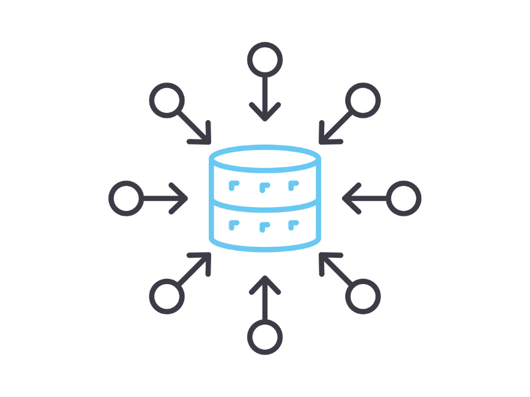
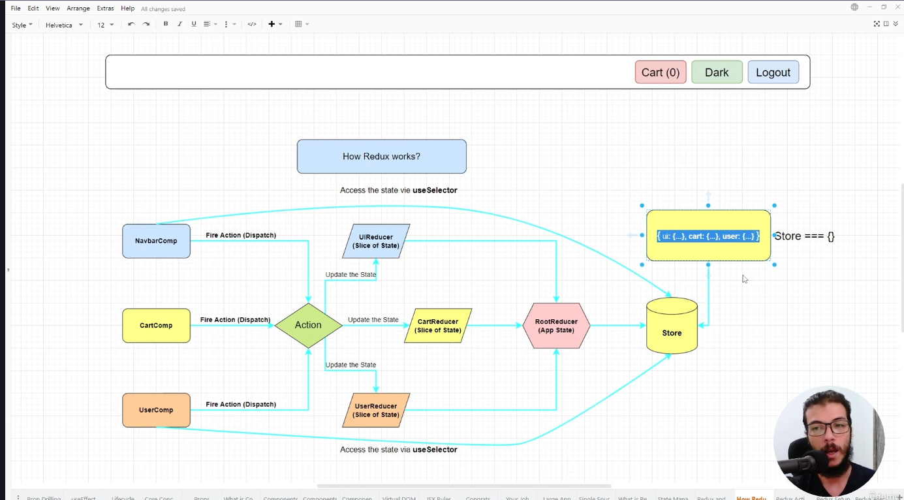

# Why we use Redux ? 

## 🌪️ Prop Drilling Problem


### 🔍 What is Prop Drilling?
Prop drilling is when you pass data from a top-level component down to deeply nested child components through many layers, even if those intermediate components don't need the data themselves.

**Example:**

```jsx
function App() {
  const user = { name: 'Makrious' };

  return <Parent user={user} />;
}

function Parent({ user }) {
  return <Child user={user} />;
}

function Child({ user }) {
  return <GrandChild user={user} />;
}

function GrandChild({ user }) {
  return <div>Hello, {user.name}</div>;
}
```

🌟 **Problem:** If the `GrandChild` is the only one needing `user`, it’s inefficient and makes refactoring difficult.

---

# Solving the problem using Redux

## 🧠 SSOT (Single Source of Truth)



### ✅ Why SSOT?
Using SSOT, we **store state in a central place** (like Redux), so all components can access it **directly**, without passing through others.

---

# 🧰 Redux (Using [Redux Toolkit](https://redux.js.org/introduction/getting-started))

- Redux is a state management library that creates a **global store** accessible from any component.

- Redux Works with three main characteristics
  - Type
  - Action
  - Reducer => Slices are written here

## 1. Install Redux Toolkit and React Redux

**Redux Toolkit**
```bash
yarn add @reduxjs/toolkit
```

**Create a React Redux App**
```bash
# Vite with our Redux+TS template
# (using the `degit` tool to clone and extract the template)
npx degit reduxjs/redux-templates/packages/vite-template-redux my-app

# Next.js using the `with-redux` template
npx create-next-app --example with-redux my-app
```

**Redux Core**
```bash
yarn add redux
```
➡️ *We installed the tools that allow global state management with minimal setup.*

---

## 2. Create a slice (`userSlice.js`)

### ❓ What is a Slice?
A **slice** in Redux Toolkit is a collection of reducer logic and actions for a single feature in your app. It helps organize state and logic in a modular way.

```js
import { createSlice, PayloadAction } from '@reduxjs/toolkit'
import type { RootState } from '../../app/store'

// Define a type for the slice state
export interface CounterState {
  value: number
}

// Define the initial state using that type
const initialState: CounterState = {
  value: 0
}

export const counterSlice = createSlice({
  name: 'counter',
  // `createSlice` will infer the state type from the `initialState` argument
  initialState,
  reducers: {
    increment: state => {
      state.value += 1
    },
    decrement: state => {
      state.value -= 1
    },
    // Use the PayloadAction type to declare the contents of `action.payload`
    incrementByAmount: (state, action: PayloadAction<number>) => {
      state.value += action.payload
    }
  }
})

export const { increment, decrement, incrementByAmount } = counterSlice.actions

// Other code such as selectors can use the imported `RootState` type
export const selectCount = (state: RootState) => state.counter.value

export default counterSlice.reducer
```
➡️ *We created a slice to define the user state and logic in one place, improving organization.*

---

## 3. Configure the store (`store.js`)



```js
import { configureStore } from '@reduxjs/toolkit'
import counterSlice from '../features/counter/counterSlice'

export default configureStore({
  reducer: {
    counter: counterSlice
  }
})
```

➡️ *We created a centralized store that holds the global state for the app.*

---

## 4. Provide the store to your app (`index.js`)

```js
import React from 'react'
import { createRoot } from 'react-dom/client'
import './index.css'
import App from './App'
import store from './app/store'
import { Provider } from 'react-redux'

const root = createRoot(document.getElementById('root')!)

root.render(
  <React.StrictMode>
    <Provider store={store}>
      <App />
    </Provider>
  </React.StrictMode>,
)
```
➡️ *We made the store available to all components via the Provider wrapper.*

---

## 5. Add Slice Reducer to the store

```jsx
import { configureStore } from '@reduxjs/toolkit'
import counterReducer from '../features/counter/counterSlice'

export default configureStore({
  reducer: {
    counter: counterReducer
  }
})
```

---

## 6. Access the store in any component

```js
import React from 'react'
import { useSelector, useDispatch } from 'react-redux'
import { decrement, increment } from './counterSlice'
import styles from './Counter.module.css'

export function Counter() {
  const count = useSelector(state => state.counter.value)
  const dispatch = useDispatch()

  return (
    <div>
      <div>
        <button
          aria-label="Increment value"
          onClick={() => dispatch(increment())}
        >
          Increment
        </button>
        <span>{count}</span>
        <button
          aria-label="Decrement value"
          onClick={() => dispatch(decrement())}
        >
          Decrement
        </button>
      </div>
    </div>
  )
}
```
➡️ *We accessed and updated the global state directly without passing props through parents.*

---

## ✅ Solving Prop Drilling with Redux

| Feature              | With Prop Drilling | With Redux         |
| -------------------- | ------------------ | ------------------ |
| Readability          | ❌ Decreases        | ✅ Increases        |
| Maintenance          | ❌ Hard to refactor | ✅ Easy to refactor |
| Reusability          | ❌ Less flexible    | ✅ More flexible    |
| Component Decoupling | ❌ Tight coupling   | ✅ Loose coupling   |

---

## 📌 Visual Summary

| Concept         | Illustration                                    |
| --------------- | ----------------------------------------------- |
| Prop Drilling   |  |
| SSOT with Redux |                      |

---
- **[Redux Tutorial](https://www.youtube.com/playlist?list=PLC3y8-rFHvwiaOAuTtVXittwybYIorRB3)** from youtube.
---
