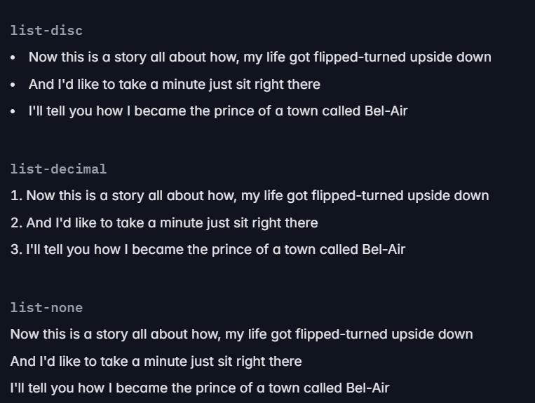
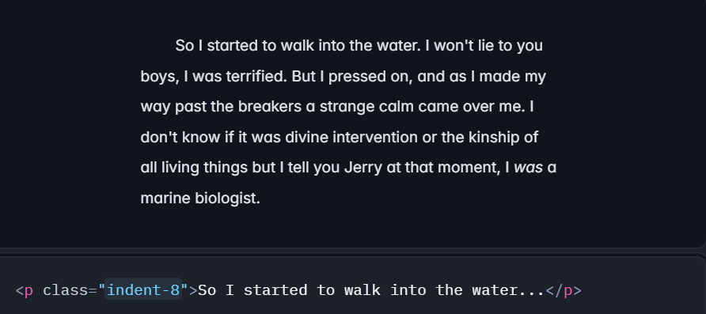
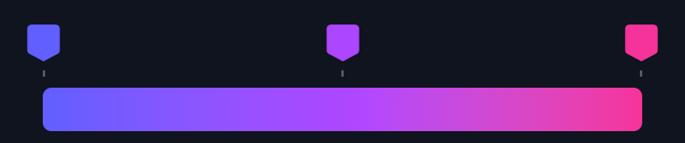
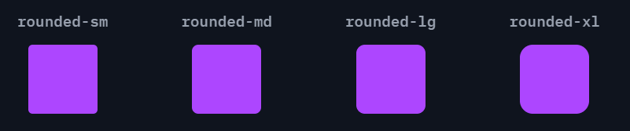
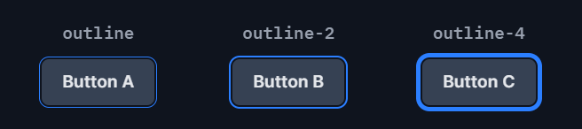
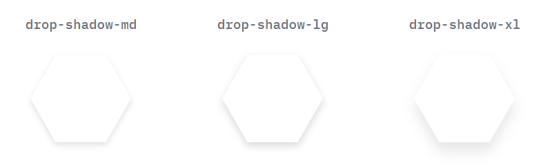
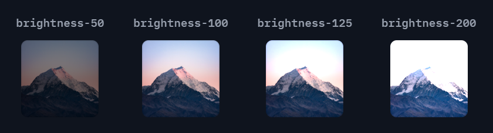
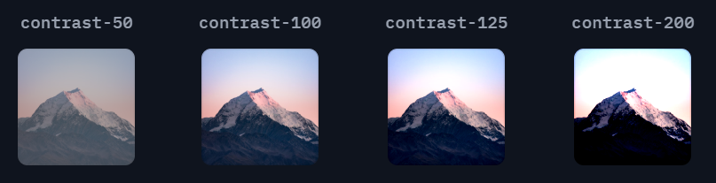
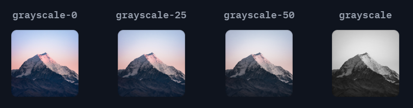

# Styling Guide Using Tailwind CSS

This guide outlines a step-by-step process for effectively styling elements using Tailwind CSS.

---

## Steps for Styling Each Element

1. **Add the HTML** – Structure your element with semantic HTML.
2. **Layout** – Define the positioning using Flexbox, Grid, or other layout utilities.
3. **Spacing** – Apply margins (`m-*`) and paddings (`p-*`) for proper spacing.
4. **Box Properties** – Style borders, backgrounds, and shadows for visual enhancements.
5. **Typography** – Adjust text size, weight, alignment, and spacing.
6. **Fun Elements** – Add transitions, animations, and interactive styles.
7. **Responsive Design** – Use responsive utilities to ensure adaptability across devices.

---

## Colors in Tailwind

- Below are the common Tailwind classes used for styling colors:

| Property         | Class Name                     |
|------------------|--------------------------------|
| **Text Color**   | `text-{color}-{shade}`         |
| **Background**   | `bg-{color}-{shade}`           |
| **Border**       | `border-{color}-{shade}`       |

- Creating my own colors

In the css file
```css
    @import "tailwindcss";

    @theme {
        --color-ColorName: #HexCode;
    }
```

In the TS file
```tsx
    const App = () => {
    return (
        <>
        <h1 className='bg-ColorName'>Hello World !</h1>
        </>
    )
    }

    export default App
```
---

## Directives

- Directives are custom Tailwind-specific at-rules you can use in your CSS that offer special functionality for Tailwind CSS projects.

| Directive        | Description |
|-----------------|-------------|
| `@import`       | Use to inline import CSS files. |
| `@theme`        | Defines project's custom design tokens like fonts, colors, and breakpoints. |
| `@source`       | Explicitly specifies source files that aren't detected automatically by Tailwind. |
| `@utility`      | Adds custom utilities that work with variants like `hover`, `focus`, and `lg`. |
| `@variant`      | Applies a Tailwind variant to styles in CSS. |
| `@custom-variant` | Adds a custom variant to the project. |
| `@apply`        | Inlines existing utility classes into custom CSS. |
| `@reference`    | Allows the use of `@apply` or `@variant` within `<style>` blocks or CSS modules by importing theme variables, custom utilities, and variants. |

For more details, check the [Tailwind CSS documentation](https://tailwindcss.com/docs/functions-and-directives#directives).

---

## Layout

### Aspect Ratio
Utilities for controlling the aspect ratio of an element.

| Class               | Usage Description |
|---------------------|------------------------------------------------------------|
| `aspect-<ratio>`   | Defines a custom aspect ratio, e.g., `aspect-16/9` for a 16:9 ratio. |
| `aspect-square`    | Forces the element to have a 1:1 aspect ratio. |
| `aspect-video`     | Sets an aspect ratio of 16:9, suitable for videos. |
| `aspect-auto`      | Uses the browser's default aspect ratio. |

### Columns
Utilities for controlling the number of columns within an element.

| Class              | Usage Description |
|-------------------|------------------------------------------------------------|
| `columns-<number>` | Specifies the number of columns explicitly, e.g., `columns-3`. |
| `columns-3xs` to `columns-7xl` | Predefined column width sizes from extra small to extra large. |
| `columns-auto`    | Automatically determines the number of columns based on content size. |

### Gap
Use `gap-<width>` utilities to specify the width between grid and flex items.

| Class          | Usage Description |
|--------------|------------------------------------------------------------|
| `gap-<size>` | Sets the gap size between grid or flex items, e.g., `gap-4` for spacing of 1rem. |

### Break After
Utilities for controlling how a column or page should break after an element.

| Class                  | Usage Description |
|------------------------|------------------------------------------------------------|
| `break-after-auto`     | Allows automatic column/page breaking. |
| `break-after-avoid`    | Prevents column/page breaks after the element. |
| `break-after-all`      | Forces a break after the element. |
| `break-after-page`     | Forces a page break after the element. |
| `break-after-column`   | Forces a column break after the element. |

### Break Before
Utilities for controlling how a column or page should break before an element.

| Class                  | Usage Description |
|------------------------|------------------------------------------------------------|
| `break-before-auto`    | Allows automatic column/page breaking. |
| `break-before-avoid`   | Prevents column/page breaks before the element. |
| `break-before-all`     | Forces a break before the element. |
| `break-before-page`    | Forces a page break before the element. |
| `break-before-column`  | Forces a column break before the element. |

### Break Inside
Utilities for controlling how a column or page should break inside an element.

| Class                  | Usage Description |
|------------------------|------------------------------------------------------------|
| `break-inside-auto`    | Allows automatic breaking inside the element. |
| `break-inside-avoid`   | Prevents breaks inside the element. |
| `break-inside-column`  | Prevents column breaks inside the element. |

### Box Decoration Break
Utilities for controlling how element fragments should be rendered across multiple lines, columns, or pages.

| Class                   | Usage Description |
|------------------------|------------------------------------------------------------|
| `box-decoration-clone` | Duplicates element backgrounds and borders across breaks. |
| `box-decoration-slice` | Keeps background and borders continuous across breaks. |

### Box Sizing
Utilities for controlling how the browser should calculate an element's total size.

| Class         | Usage Description |
|-------------|------------------------------------------------------------|
| `box-border` | Includes padding and border in the element’s total width and height. |
| `box-content` | Excludes padding and border from the element’s total width and height. |

### Display
Utilities for controlling the display property of an element.

| Class          | Usage Description |
|--------------|------------------------------------------------------------|
| `block`       | Displays an element as a block. |
| `inline`      | Displays an element inline. |
| `inline-block` | Displays an element inline while allowing width/height adjustments. |
| `flex`        | Enables flexbox layout. |
| `grid`        | Enables grid layout. |
| `hidden`      | Hides the element. |

### Float
Utilities for controlling the floating behavior of an element.

| Class          | Usage Description |
|--------------|------------------------------------------------------------|
| `float-left`  | Floats an element to the left. |
| `float-right` | Floats an element to the right. |
| `float-none`  | Disables floating. |

### Clear
Utilities for controlling the wrapping of floated elements.

| Class         | Usage Description |
|-------------|------------------------------------------------------------|
| `clear-left`  | Prevents floating elements from appearing on the left. |
| `clear-right` | Prevents floating elements from appearing on the right. |
| `clear-none`  | Allows elements to appear next to floated elements. |

### Isolation
Utilities for controlling whether an element creates a new stacking context.

| Class         | Usage Description |
|-------------|------------------------------------------------------------|
| `isolate`   | Creates a new stacking context. |
| `isolation-auto` | Uses the browser’s default stacking context. |

### Object Fit
Utilities for controlling how replaced elements fit within their container.

| Class            | Usage Description |
|----------------|------------------------------------------------------------|
| `object-contain` | Resizes content to fit within the element while maintaining aspect ratio. |
| `object-cover` | Scales content to fill the element while maintaining aspect ratio. |
| `object-fill` | Stretches content to fill the entire element. |
| `object-none` | Keeps the original size of the content. |

### Object Position
Utilities for positioning replaced elements inside their container.

| Class                  | Usage Description |
|-----------------------|------------------------------------------------------------|
| `object-bottom`       | Positions content at the bottom. |
| `object-center`       | Centers content within the element. |
| `object-left`         | Aligns content to the left. |
| `object-right`        | Aligns content to the right. |

### Overflow
Utilities for controlling how an element handles overflowing content.

| Class            | Usage Description |
|----------------|------------------------------------------------------------|
| `overflow-auto` | Enables scrolling when necessary. |
| `overflow-hidden` | Hides overflowing content. |
| `overflow-visible` | Allows overflowing content to be visible. |
| `overflow-scroll` | Enables scrolling always, even if content fits. |
| `overflow-x-auto` | Enables horizontal scrolling when necessary. |
| `overflow-y-auto` | Enables vertical scrolling when necessary. |

### Overscroll Behavior
Utilities for controlling browser behavior at scroll boundaries.

| Class               | Usage Description |
|--------------------|------------------------------------------------------------|
| `overscroll-auto`  | Default overscroll behavior. |
| `overscroll-contain` | Prevents page scrolling when reaching an element boundary. |
| `overscroll-none` | Disables overscroll effects. |

### Position
Utilities for controlling how an element is positioned.

| Class        | Usage Description |
|------------|------------------------------------------------------------|
| `static`   | Default positioning (normal document flow). |
| `fixed`    | Positions element relative to the viewport. |
| `absolute` | Positions element relative to its nearest positioned ancestor. |
| `relative` | Positions element relative to its normal position. |
| `sticky`   | Positions element based on scroll position. |

### Top / Right / Bottom / Left
Utilities for positioning elements.

| Class          | Usage Description |
|--------------|------------------------------------------------------------|
| `inset-<number>` | Sets the top, right, bottom, and left values simultaneously. |
| `top-<number>` | Positions the element from the top. |
| `right-<number>` | Positions the element from the right. |
| `bottom-<number>` | Positions the element from the bottom. |
| `left-<number>` | Positions the element from the left. |

### Visibility
Utilities for controlling element visibility.

| Class        | Usage Description |
|------------|------------------------------------------------------------|
| `visible`   | Makes the element visible. |
| `invisible` | Hides the element while keeping its space reserved. |
| `collapse`  | Hides the element, mainly for table elements. |

### Z-Index
Utilities for controlling stack order.

| Class       | Usage Description |
|-----------|------------------------------------------------------------|
| `z-<number>` | Sets the z-index, controlling the stacking order of elements. |

---
## Flexbox & Grid

### Flex Basis
Utilities for controlling the initial size of flex items.

| Class         | Usage Description |
|--------------|-----------------------------------------------------------|
| `basis-<number>` | Sets the initial size of a flex item, e.g., `basis-1/2` for half width. |
| `basis-full` | Makes the flex item take up the full width of its container. |
| `basis-auto` | Sets the flex basis to auto, allowing natural sizing. |

### Flex Direction
Utilities for controlling the direction of flex items.

| Class               | Usage Description |
|--------------------|-----------------------------------------------------------|
| `flex-row`        | Lays out flex items in a horizontal row (left to right). |
| `flex-row-reverse` | Lays out flex items in a horizontal row (right to left). |
| `flex-col`        | Stacks flex items in a vertical column (top to bottom). |
| `flex-col-reverse` | Stacks flex items in a vertical column (bottom to top). |

### Flex Wrap
Utilities for controlling how flex items wrap.

| Class             | Usage Description |
|------------------|-----------------------------------------------------------|
| `flex-nowrap`    | Prevents flex items from wrapping to the next line. |
| `flex-wrap`      | Allows flex items to wrap onto the next line. |
| `flex-wrap-reverse` | Wraps flex items in reverse order. |

### Flex
Utilities for controlling how flex items grow and shrink.

| Class       | Usage Description |
|------------|-----------------------------------------------------------|
| `flex-<number>` | Defines the flex-grow and flex-shrink properties together, e.g., `flex-1` allows equal growth. |

### Flex Grow
Utilities for controlling how flex items grow.

| Class  | Usage Description |
|-------|-----------------------------------------------------------|
| `grow` | Allows a flex item to grow to fill available space. |
| `grow-0` | Prevents a flex item from growing. |

### Flex Shrink
Utilities for controlling how flex items shrink.

| Class  | Usage Description |
|-------|-----------------------------------------------------------|
| `shrink` | Allows a flex item to shrink if necessary. |
| `shrink-0` | Prevents a flex item from shrinking. |

### Order
Utilities for controlling the order of flex and grid items.

| Class         | Usage Description |
|--------------|-----------------------------------------------------------|
| `order-<number>` | Specifies the order of an item within a flex or grid container, e.g., `order-1` moves the item to the second position. |

---

## Grid System

### Grid Template Columns
Defines the column structure of a grid.

| Class                   | Usage Description |
|------------------------|-----------------------------------------------------------|
| `grid-cols-<number>`   | Defines the number of columns in a grid, e.g., `grid-cols-3` creates three equal columns. |
| `grid-cols-none`       | Removes any explicit column definitions. |

### Grid Column
Controls how elements span across grid columns.

| Class                   | Usage Description |
|------------------------|-----------------------------------------------------------|
| `col-span-<number>`   | Specifies how many columns an element should span, e.g., `col-span-2`. |
| `col-span-full`       | Makes an element span across all columns. |
| `col-start-<number>`  | Specifies the start column position. |
| `col-end-<number>`    | Specifies the end column position. |

### Grid Template Rows
Defines the row structure of a grid.

| Class                  | Usage Description |
|-----------------------|-----------------------------------------------------------|
| `grid-rows-<number>` | Defines the number of rows in a grid, e.g., `grid-rows-4`. |
| `grid-rows-none`     | Removes any explicit row definitions. |

### Grid Row
Controls how elements span across grid rows.

| Class                  | Usage Description |
|-----------------------|-----------------------------------------------------------|
| `row-span-<number>`  | Specifies how many rows an element should span. |
| `row-span-full`      | Makes an element span across all rows. |
| `row-start-<number>` | Specifies the start row position. |
| `row-end-<number>`   | Specifies the end row position. |

### Grid Auto Flow
Controls how items are placed in an implicitly created grid.

| Class               | Usage Description |
|--------------------|-----------------------------------------------------------|
| `grid-flow-row`    | Places items in rows by default. |
| `grid-flow-col`    | Places items in columns by default. |
| `grid-flow-dense`  | Compacts the grid to fill in gaps automatically. |

### Grid Auto Columns
Defines the size of implicit grid columns.

| Class                 | Usage Description |
|----------------------|-----------------------------------------------------------|
| `auto-cols-auto`    | Lets the browser automatically determine column size. |
| `auto-cols-min`     | Sets implicit columns to the smallest possible size. |
| `auto-cols-max`     | Sets implicit columns to the largest possible size. |
| `auto-cols-fr`      | Assigns a flexible fraction of available space. |

### Grid Auto Rows
Defines the size of implicit grid rows.

| Class               | Usage Description |
|--------------------|-----------------------------------------------------------|
| `auto-rows-auto`  | Lets the browser automatically determine row size. |
| `auto-rows-min`   | Sets implicit rows to the smallest possible size. |
| `auto-rows-max`   | Sets implicit rows to the largest possible size. |
| `auto-rows-fr`    | Assigns a flexible fraction of available space. |

### Gap
Utilities for controlling the spacing between grid and flex items.

| Class          | Usage Description |
|--------------|-----------------------------------------------------------|
| `gap-<size>` | Sets both row and column gaps, e.g., `gap-4` for 1rem spacing. |
| `gap-x-<size>` | Sets only the horizontal gap. |
| `gap-y-<size>` | Sets only the vertical gap. |

### Justify Content
Aligns flex or grid items along the main axis.

| Class                  | Usage Description |
|-----------------------|-----------------------------------------------------------|
| `justify-start`       | Aligns items to the start of the container. |
| `justify-center`      | Centers items in the container. |
| `justify-end`         | Aligns items to the end of the container. |
| `justify-between`     | Distributes items evenly with space between them. |
| `justify-around`      | Distributes items with equal space around them. |
| `justify-evenly`      | Distributes items with equal space between and around them. |

### Justify Items
Aligns grid items along the horizontal axis.

| Class                 | Usage Description |
|----------------------|-----------------------------------------------------------|
| `justify-items-start`  | Aligns grid items to the start. |
| `justify-items-center` | Centers grid items. |
| `justify-items-end`    | Aligns grid items to the end. |

### Justify Self
Aligns an individual grid item along the horizontal axis.

| Class             | Usage Description |
|------------------|-----------------------------------------------------------|
| `justify-self-start`  | Aligns the item to the start of the grid cell. |
| `justify-self-center` | Centers the item in the grid cell. |
| `justify-self-end`    | Aligns the item to the end of the grid cell. |

### Align Content
Aligns multiple flex/grid items along the cross axis.

| Class                 | Usage Description |
|----------------------|-----------------------------------------------------------|
| `content-start`      | Aligns content to the start. |
| `content-center`     | Centers content. |
| `content-end`        | Aligns content to the end. |
| `content-between`    | Distributes content with space between items. |

### Align Items
Aligns items along the cross axis.

| Class           | Usage Description |
|--------------|-----------------------------------------------------------|
| `items-start`  | Aligns items to the start of the container. |
| `items-center` | Centers items in the container. |
| `items-end`    | Aligns items to the end of the container. |

### Align Self
Aligns an individual item along the cross axis.

| Class         | Usage Description |
|--------------|-----------------------------------------------------------|
| `self-start` | Aligns the item to the start of the container. |
| `self-center` | Centers the item in the container. |
| `self-end`   | Aligns the item to the end of the container. |

---

## Spacing

### Padding

| Class | Description |
|-------|-------------|
| `p-<number>` | Applies padding to all four sides. |
| `pr-<number>` | Applies padding to the right side. |
| `pl-<number>` | Applies padding to the left side. |
| `pt-<number>` | Applies padding to the top. |
| `pb-<number>` | Applies padding to the bottom. |
| `px-<number>` | Applies padding to the left and right. |
| `py-<number>` | Applies padding to the top and bottom. |
| `ps-<number>` | Applies padding to the inline-start. |
| `pe-<number>` | Applies padding to the inline-end. |
| `p-[<value>]` | Applies custom padding values, e.g., `p-[5px]`. |
| `p-(--my-padding)` | Uses a custom CSS variable for padding. |

### Margin

| Class | Description |
|-------|-------------|
| `m-<number>` | Applies margin to all four sides. |
| `mr-<number>` | Applies margin to the right side. |
| `ml-<number>` | Applies margin to the left side. |
| `mt-<number>` | Applies margin to the top. |
| `mb-<number>` | Applies margin to the bottom. |
| `mx-<number>` | Applies margin to the left and right. |
| `my-<number>` | Applies margin to the top and bottom. |
| `ms-<number>` | Applies margin to the inline-start. |
| `me-<number>` | Applies margin to the inline-end. |
| `m-[<value>]` | Applies custom margin values, e.g., `m-[5px]`. |
| `m-(--my-margin)` | Uses a custom CSS variable for margin. |
| `space-x-<number>` | Controls the space between inline elements horizontally. |

---

## Sizing

### Width

| Class | Description |
|-------|-------------|
| `w-<number>` | Sets the width to a specific numeric value. |
| `w-<fraction>` | Sets the width as a fraction of the container, e.g., `w-1/2`. |
| `w-xs` to `w-7xl` | Sets the width to predefined size classes. |
| `w-auto` | Adjusts width to fit the content. |
| `w-full` | Sets width to 100% of the parent container. |
| `w-screen` | Sets width to 100% of the viewport width. |
| `w-max` | Sets width to the maximum content width. |
| `w-min` | Sets width to the minimum content width. |

### Min Width

| Class | Description |
|-------|-------------|
| `min-w-<number>` | Sets the minimum width to a numeric value. |
| `min-w-<fraction>` | Sets the minimum width as a fraction. |
| `min-w-xs` to `min-w-7xl` | Sets minimum width to predefined sizes. |
| `min-w-auto` | Adjusts the minimum width to fit content. |
| `min-w-full` | Sets the minimum width to 100% of the parent container. |
| `min-w-screen` | Sets the minimum width to 100% of the viewport. |
| `min-w-max` | Sets the minimum width to the maximum content size. |
| `min-w-min` | Sets the minimum width to the minimum content size. |

### Max Width

| Class | Description |
|-------|-------------|
| `max-w-<number>` | Sets the maximum width to a numeric value. |
| `max-w-<fraction>` | Sets the maximum width as a fraction. |
| `max-w-xs` to `max-w-7xl` | Sets maximum width to predefined sizes. |
| `max-w-auto` | Adjusts the maximum width dynamically. |
| `max-w-full` | Sets the maximum width to 100% of the parent. |
| `max-w-screen` | Sets the maximum width to 100% of the viewport. |
| `max-w-max` | Sets the maximum width to the largest possible size. |
| `max-w-min` | Sets the maximum width to the smallest possible size. |

---

### Height

| Class | Description |
|-------|-------------|
| `h-<number>` | Sets height to a specific numeric value. |
| `h-<fraction>` | Sets height as a fraction of the container. |
| `h-xs` to `h-7xl` | Sets height to predefined sizes. |
| `h-auto` | Adjusts height dynamically based on content. |
| `h-full` | Sets height to 100% of the parent container. |
| `h-screen` | Sets height to 100% of the viewport height. |
| `h-max` | Sets height to the maximum content size. |
| `h-min` | Sets height to the minimum content size. |

### Min Height

| Class | Description |
|-------|-------------|
| `min-h-<number>` | Sets the minimum height to a numeric value. |
| `min-h-<fraction>` | Sets the minimum height as a fraction. |
| `min-h-xs` to `min-h-7xl` | Sets minimum height to predefined sizes. |
| `min-h-auto` | Adjusts the minimum height to fit content. |
| `min-h-full` | Sets the minimum height to 100% of the parent container. |
| `min-h-screen` | Sets the minimum height to 100% of the viewport. |
| `min-h-max` | Sets the minimum height to the maximum content size. |
| `min-h-min` | Sets the minimum height to the minimum content size. |

### Max Height

| Class | Description |
|-------|-------------|
| `max-h-<number>` | Sets the maximum height to a numeric value. |
| `max-h-<fraction>` | Sets the maximum height as a fraction. |
| `max-h-xs` to `max-h-7xl` | Sets maximum height to predefined sizes. |
| `max-h-auto` | Adjusts the maximum height dynamically. |
| `max-h-full` | Sets the maximum height to 100% of the parent. |
| `max-h-screen` | Sets the maximum height to 100% of the viewport. |
| `max-h-max` | Sets the maximum height to the largest possible size. |
| `max-h-min` | Sets the maximum height to the smallest possible size. |

---

### Size (Width & Height)

| Class | Description |
|-------|-------------|
| `size-<number>` | Sets both width and height to a specific value. |
| `size-auto` | Adjusts both width and height dynamically. |
| `size-full` | Sets both width and height to 100% of the parent. |
| `size-fit` | Sets both width and height to fit content. |
| `size-max` | Sets both width and height to the maximum available size. |
| `size-min` | Sets both width and height to the minimum available size. |

---

## Typography

### Default Fonts
- `font-sans`
- `font-serif`
- `font-mono`

### How to Use the Fonts?
```html
<p class="font-sans">The quick brown fox ...</p>
<p class="font-serif">The quick brown fox ...</p>
<p class="font-mono">The quick brown fox ...</p>
```

### Custom Font
```css
@import url("https://fonts.googleapis.com/css2?family=Roboto&display=swap");
@import "tailwindcss";
@theme {
    --font-roboto: "Roboto", sans-serif; 
}
```
```html
<p class="font-roboto">This will use Roboto font family.</p>
```

---

### Font Size
- Ordered from smaller to larger:
  - `text-xs`
  - `text-sm`
  - `text-base`
  - `text-lg`
  - `text-xl`
  - `text-2xl`
  - ...
  - `text-9xl`

#### Custom Text Size
```html
<p class="text-[14px]">Custom text size example</p>
```

---

### Line Height
- `leading-none`
- `text-sm/6`
- `text-sm/7`
- `text-sm/8`

#### Customizing Line Height
```css
@theme {
    --text-tiny: 0.625rem; 
}
```
```html
<div class="text-tiny">Custom line height example</div>
```

---

### Font Style
- `italic`
- `underline`

### Font Weight
- Ordered from thinner to bolder:
  - `font-thin`
  - `font-extralight`
  - `font-light`
  - `font-normal`
  - `font-medium`
  - `font-semibold`
  - `font-bold`
  - `font-extrabold`
  - `font-black`

#### Customizing Font Weight
```css
@theme {
    --font-weight-extrablack: 1000; 
}
```
```html
<div class="font-extrablack">Custom font weight</div>
```

---

### Numeric Fonts
- `normal-nums`
- `ordinal`
- `slashed-zero`
- `lining-nums`
- `oldstyle-nums`
- `proportional-nums`
- `tabular-nums`
- `diagonal-fractions`
- `stacked-fractions`

---

### Letter Spacing
- Ordered from tighter to wider:
  - `tracking-tighter`
  - `tracking-tight`
  - `tracking-normal`
  - `tracking-wide`
  - `tracking-wider`
  - `tracking-widest`

---

### Line Clamping
- `line-clamp-{number}`
- `line-clamp-none`

#### Example
```html
<p class="line-clamp-3">Truncated text with line clamping.</p>
```

---

### List Style Image
```html
<ul class="list-image-[url(/img/checkmark.png)]">
  <li>5 cups chopped Porcini mushrooms</li>
</ul>
```

### List Style Position


### List Style Type


---

### Text Alignment
- `text-left`
- `text-center`
- `text-right`
- `text-justify`
- `text-start`
- `text-end`

### Text Color
- `text-{color}-{degree}`
- `text-{color}-{degree}/opacityPercent`

---

### Text Decoration
#### Line
- `underline`
- `overline`
- `line-through`
- `no-underline`

#### Color
- `decoration-{color}-{degree}`

#### Style


#### Thickness


#### Underline Offset


---

### Text Transform
- `uppercase`
- `lowercase`
- `capitalize`
- `normal-case`

### Text Overflow
| Utility        | Description |
|---------------|------------|
| `truncate`    | Prevents text from wrapping and truncates overflowing text with an ellipsis (…) if needed. |
| `text-ellipsis` | Truncates overflowing text with an ellipsis (…) if needed. |
| `text-clip`   | Truncates the text at the limit of the content area. |

### Text Wrap
- `text-wrap`
- `text-nowrap`
- `text-balance`
- `text-pretty`

### Text Indent
- `indent-{number}`  


### Vertical Align
- `align-baseline`
- `align-middle`
- `align-bottom`
- `align-text-top`
- `align-text-bottom`
- `align-sub`
- `align-super`

### White Space
- `whitespace-normal`
- `whitespace-nowrap`
- `whitespace-pre`
- `whitespace-pre-line`
- `whitespace-pre-wrap`
- `whitespace-break-spaces`

### Content
- `content-[Element]`
- `before:content-[Element]`
- `after:content-[Element]`

---

## Backgrounds

### Background Attachment
Utilities for controlling how a background image behaves when scrolling.

| Class        | Usage |
|-------------|-----------------------------------------------|
| `bg-fixed`  | The background image is fixed relative to the viewport. |
| `bg-local`  | The background image scrolls with the element's content. |
| `bg-scroll` | The background image scrolls with the page. |

### Background Clip
Utilities for controlling the bounding box of an element's background.

| Class             | Usage |
|------------------|----------------------------------------------------|
| `bg-clip-border`  | The background extends to the border. |
| `bg-clip-padding` | The background extends to the padding box. |
| `bg-clip-content` | The background extends to the content box. |
| `bg-clip-text`    | The background is clipped to the text. |


### Background Color
Utilities for controlling an element's background color.

| Class                          | Usage |
|--------------------------------|------------------------------------------------------|
| `bg-colorName-Degree`         | Sets a solid background color with a specific shade. |
| `bg-colorName-Degree/Opacity` | Sets a background color with transparency. |
| `bg-[#HexCode]`               | Sets a background color using a hexadecimal code. |

### Background Image
Utilities for controlling an element's background image.

| Class               | Usage |
|--------------------|--------------------------------------------------------|
| `bg-radial`       | Applies a radial gradient background. |
| `bg-[url(…)]`     | Sets a background image from a given URL or path. |
| `bg-to-*`         | Defines the direction of a gradient. (e.g., `bg-to-r`) |
| `from-*`          | Specifies the starting color of a gradient. |
| `via-*`           | Defines a middle color in a gradient. |
| `to-*`            | Specifies the ending color of a gradient. |

Example:
```html
<div class="bg-gradient-to-r from-indigo-500 via-purple-500 to-pink-500 ..."></div>
```

Output:



### Background Origin
Utilities for controlling how an element's background is positioned relative to borders, padding, and content.


### Background Position
Utilities for controlling the position of an element's background image.


### Background Repeat
Utilities for controlling the repetition of an element's background image.

| Class              | Usage |
|-------------------|------------------------------------------------|
| `bg-repeat`      | The background image repeats in both directions. |
| `bg-repeat-x`    | The background repeats horizontally. |
| `bg-repeat-y`    | The background repeats vertically. |
| `bg-repeat-space`| The background repeats with spacing. |
| `bg-repeat-round`| The background scales to fit without gaps. |
| `bg-no-repeat`   | The background image does not repeat. |

### Background Size
Utilities for controlling the background size of an element's background image.

| Class        | Usage |
|------------|--------------------------------------------------|
| `bg-auto`   | The background image retains its original size. |
| `bg-cover`  | The background image covers the entire element. |
| `bg-contain`| The background image fits within the element without cropping. |


## Borders

### Border Radius
Utilities for controlling the border radius of an element.

| Class           | Usage |
|---------------|--------------------------------|
| `rounded-xs`  | Applies a very small border radius. |
| `rounded-sm`  | Applies a small border radius. |
| `rounded-md`  | Applies a medium border radius. |
| `rounded-lg`  | Applies a large border radius. |
| `rounded-xl`  | Applies an extra-large border radius. |
| `rounded-2xl` | Applies a double extra-large border radius. |
| `rounded-3xl` | Applies a triple extra-large border radius. |
| `rounded-none` | Removes any border radius. |
| `rounded-full` | Makes the element fully rounded. |
| `rounded-[<value>]` | Sets a custom border radius value. |



### Border Width
Utilities for controlling the width of an element's borders.


| Class              | Usage |
|-------------------|------------------------------------------------------|
| `divide-x-number` | Adds a horizontal border between grid columns. |
| `divide-y-number` | Adds a vertical border between flex items. |
| `divide-y-reverse` | Reverses the vertical border placement. |

#### Example:
```html
<div class="grid grid-cols-3 divide-x-4">
    <div>01</div>
    <div>02</div>
    <div>03</div>
</div>
```
Output:  


Example:  
```html
<div class="flex flex-col-reverse divide-y-4 divide-y-reverse divide-gray-200">
    <div>01</div>
    <div>02</div>
    <div>03</div>
</div>
```
Output:  


### Applying on Focus
Utilities for controlling border color when an element is focused.

| Class                      | Usage |
|---------------------------|-----------------------------------------------|
| `focus:border-colorName-degree` | Changes border color on focus. |

#### Example:
```html
<input class="border-2 border-gray-700 focus:border-pink-600 ..." />
```
Output:  


### Border Style
Utilities for controlling the border style of an element.


### Outline Width
Utilities for controlling the outline width of an element.



---

## Effects

### Box Shadow
Utilities for controlling the box shadow of an element.

| Class         | Usage |
|--------------|-------|
| `shadow-2xs` | Applies an extra extra small shadow effect. |
| `shadow-xs`  | Applies an extra small shadow effect. |
| `shadow-sm`  | Applies a small shadow effect. |
| `shadow-md`  | Applies a medium shadow effect. |
| `shadow-lg`  | Applies a large shadow effect. |
| `shadow-xl`  | Applies an extra large shadow effect. |
| `shadow-2xl` | Applies a twice extra large shadow effect. |
| `shadow-none` | Removes any shadow effect. |



---

### Shadow Color
Utilities for applying specific colors to shadows.

| Class | Usage |
|-------|-------|
| `shadow-colorName-degree/opacityPercentage` | Sets the shadow color with a specified degree and opacity. |

---

### Inset Shadow
Utilities for adding an inset shadow effect inside an element.

| Class | Usage |
|-------|-------|
| `inset-shadow-colorName-Degree` | Applies an inset shadow with a specified color and degree. |


---

### Ring
Utilities for applying an outline (ring) around an element.

| Class         | Usage |
|--------------|-------|
| `ring-<number>` | Sets the thickness of the ring outline. |


---

### Ring Color
Utilities for applying colors to ring outlines.

| Class | Usage |
|-------|-------|
| `ring-ColorName-Degree` | Sets the ring color with a specified degree. |

---

### Opacity
Utilities for controlling the opacity of an element.

| Class         | Usage |
|--------------|-------|
| `opacity-<number>` | Adjusts the transparency level of an element based on the provided number. |


---

## Filters

### Blur
Utilities for applying blur filters to an element.

| Class       | Usage |
|------------|-------|
| `blur-xs`  | Applies an extra small blur effect. |
| `blur-sm`  | Applies a small blur effect. |
| `blur-md`  | Applies a medium blur effect. |
| `blur-lg`  | Applies a large blur effect. |
| `blur-xl`  | Applies an extra large blur effect. |
| `blur-2xl` | Applies a twice extra large blur effect. |
| `blur-3xl` | Applies a three times extra large blur effect. |
| `blur-none` | Removes any blur effect. |

---

### Brightness
Utilities for applying brightness filters to an element.

| Class                  | Usage |
|------------------------|-------|
| `brightness-<number>` | Adjusts the brightness of an element based on the provided number. |



---

### Contrast
Utilities for applying contrast filters to an element.

| Class                | Usage |
|----------------------|-------|
| `contrast-<number>` | Adjusts the contrast of an element based on the provided number. |



---

### Drop Shadow
Utilities for applying drop-shadow filters to an element.

| Class               | Usage |
|---------------------|-------|
| `drop-shadow-xs`   | Applies an extra small drop shadow. |
| `drop-shadow-sm`   | Applies a small drop shadow. |
| `drop-shadow-md`   | Applies a medium drop shadow. |
| `drop-shadow-lg`   | Applies a large drop shadow. |
| `drop-shadow-xl`   | Applies an extra large drop shadow. |
| `drop-shadow-2xl`  | Applies a twice extra large drop shadow. |
| `drop-shadow-none` | Removes any drop shadow effect. |


---

### Greyscale
Utilities for applying grayscale filters to an element.

| Class                | Usage |
|----------------------|-------|
| `grayscale-<number>` | Converts an element to grayscale based on the provided number. |



---

## Tables

### Border
Utilities for controlling whether table borders should collapse or be separated.

| Class               | Usage Description |
|---------------------|----------------------------------------------------------|
| `border-collapse`  | Merges table borders into a single border. |
| `border-separate`  | Keeps table borders separate, allowing spacing between them. |

### Spacing
Utilities for controlling the spacing between table borders.

| Class                        | Usage Description |
|------------------------------|----------------------------------------------------------|
| `border-spacing-<number>`    | Sets uniform spacing between table borders in both directions. |
| `border-spacing-x-<number>`  | Sets horizontal spacing between table borders. |
| `border-spacing-y-<number>`  | Sets vertical spacing between table borders. |

### Table Layout
Utilities for controlling the table layout algorithm.

| Class          | Usage Description |
|---------------|----------------------------------------------------------|
| `table-auto`  | Allows the browser to determine column widths automatically. |
| `table-fixed` | Fixes column widths based on the first row's content. |

### Caption Side
Utilities for controlling the alignment of a caption element inside a table.

| Class            | Usage Description |
|-----------------|----------------------------------------------------------|
| `caption-top`   | Positions the table caption above the table. |
| `caption-bottom`| Positions the table caption below the table. |

---

## Transitions & Animation

### Transition Property
Utilities for controlling which CSS properties transition.

| Class                   | Usage Description |
|-------------------------|--------------------------------------------------------------|
| `transition`           | Enables a smooth transition effect on commonly animated properties. |
| `transition-all`       | Applies transitions to all properties. |
| `transition-colors`    | Applies transitions only to color-related properties. |
| `transition-opacity`   | Applies transitions to opacity changes. |
| `transition-shadow`    | Applies transitions to box-shadow changes. |
| `transition-transform` | Applies transitions to transform properties like scale and rotate. |
| `transition-none`      | Disables transitions on the element. |

### Transition Behavior
Utilities to control the behavior of CSS transitions.

| Class                 | Usage Description |
|-----------------------|--------------------------------------------------------------|
| `transition-normal`   | Uses standard, smooth transition behavior. |
| `transition-discrete` | Applies transitions in a stepwise manner without smooth interpolation. |

### Transition Duration
Utilities for controlling the duration of CSS transitions.

| Class                 | Usage Description |
|-----------------------|--------------------------------------------------------------|
| `duration-<number>`   | Specifies the transition duration in milliseconds (e.g., `duration-500`). |

### Transition Timing Function
Utilities for controlling the easing of CSS transitions.

| Class           | Usage Description |
|---------------|--------------------------------------------------------------|
| `ease-linear`  | Applies a constant speed transition. |
| `ease-in`      | Starts slow and speeds up over time. |
| `ease-out`     | Starts fast and slows down towards the end. |
| `ease-in-out`  | Combines `ease-in` and `ease-out` for a smooth effect. |
| `ease-initial` | Resets the easing function to its default value. |

### Transition Delay
Utilities for controlling the delay of CSS transitions.

| Class             | Usage Description |
|------------------|--------------------------------------------------------------|
| `delay-<number>` | Delays the start of a transition for the specified duration (e.g., `delay-300`). |

### Animation
Utilities for animating elements with CSS animations.

| Class            | Usage Description |
|-----------------|--------------------------------------------------------------|
| `animate-spin`  | Rotates the element continuously. |
| `animate-ping`  | Expands and fades out repeatedly. |
| `animate-pulse` | Gradually increases and decreases opacity in a loop. |
| `animate-bounce`| Moves the element up and down like a bouncing effect. |
| `animate-none`  | Disables animations on the element. |

---

## Transforms

### Rotate
Utilities for rotating elements.

| Class                | Usage Description |
|----------------------|------------------------------------------------------------|
| `rotate-none`       | Removes any rotation from the element. |
| `rotate-<number>`   | Rotates the element by a specified degree (e.g., `rotate-45`). |
| `-rotate-<number>`  | Rotates the element counterclockwise by a specified degree. |
| `rotate-x-<number>` | Rotates the element around the X-axis. |
| `-rotate-x-<number>`| Rotates the element around the X-axis in the opposite direction. |
| `rotate-y-<number>` | Rotates the element around the Y-axis. |
| `-rotate-y-<number>`| Rotates the element around the Y-axis in the opposite direction. |
| `rotate-z-<number>` | Rotates the element around the Z-axis. |
| `-rotate-z-<number>`| Rotates the element around the Z-axis in the opposite direction. |

### Scale
Utilities for scaling elements.

| Class              | Usage Description |
|-------------------|------------------------------------------------------------|
| `scale-none`     | Removes any scaling applied to the element. |
| `scale-<number>` | Scales the element uniformly by a specified factor. |
| `-scale-<number>`| Reverses the scale effect by a specified factor. |
| `scale-x-<number>` | Scales the element horizontally. |
| `-scale-x-<number>`| Scales the element horizontally in reverse. |
| `scale-y-<number>` | Scales the element vertically. |
| `-scale-y-<number>`| Scales the element vertically in reverse. |
| `scale-z-<number>` | Scales the element along the Z-axis. |
| `-scale-z-<number>`| Scales the element along the Z-axis in reverse. |

### Skew
Utilities for skewing elements.

| Class              | Usage Description |
|-------------------|------------------------------------------------------------|
| `skew-none`      | Removes any skew transformations from the element. |
| `skew-<number>`  | Skews the element by a specified angle. |
| `-skew-<number>` | Skews the element in the opposite direction. |
| `skew-x-<number>` | Skews the element along the X-axis. |
| `-skew-x-<number>`| Skews the element along the X-axis in reverse. |
| `skew-y-<number>` | Skews the element along the Y-axis. |
| `-skew-y-<number>`| Skews the element along the Y-axis in reverse. |
| `skew-z-<number>` | Skews the element along the Z-axis. |
| `-skew-z-<number>`| Skews the element along the Z-axis in reverse. |

### Transform
Utilities for transforming elements.

| Class              | Usage Description |
|-------------------|------------------------------------------------------------|
| `transform-none` | Disables all CSS transformations on the element. |
| `transform-gpu`  | Enables GPU acceleration for transformations, improving performance. |
| `transform-cpu`  | Uses CPU-based transformations instead of GPU acceleration. |

### Translate
Utilities for translating elements.

| Class                | Usage Description |
|----------------------|------------------------------------------------------------|
| `translate-x-<number>` | Moves the element along the X-axis by a specified amount. |
| `-translate-x-<number>`| Moves the element along the X-axis in the opposite direction. |
| `translate-y-<number>` | Moves the element along the Y-axis by a specified amount. |
| `-translate-y-<number>`| Moves the element along the Y-axis in the opposite direction. |
| `translate-z-<number>` | Moves the element along the Z-axis for depth effects. |
| `-translate-z-<number>`| Moves the element along the Z-axis in the opposite direction. |
| `translate-none`      | Removes any translation effects from the element. |


---

## Interactivity

### Accent Color
Utilities for controlling the accented color of a form control.

| Class                                | Usage Description |
|--------------------------------------|------------------------------------------------------------|
| `accent-colorName-Degree`           | Sets the accent color of form elements like checkboxes and radio buttons. |
| `accent-colorName-Degree/opacityPercentage` | Sets the accent color with a specified opacity. |

### Appearance
Utilities for suppressing native form control styling.

| Class              | Usage Description |
|-------------------|------------------------------------------------------------|
| `appearance-none` | Removes the default browser styling for form controls. |
| `appearance-auto` | Uses the default system styling for form controls. |

### Caret Color
Utilities for controlling the color of the text input cursor.

| Class                                | Usage Description |
|--------------------------------------|------------------------------------------------------------|
| `caret-colorName-Degree`            | Sets the color of the text input cursor. |
| `caret-colorName-Degree/opacityPercentage` | Sets the cursor color with a specified opacity. |

### Color Scheme
Utilities for controlling the color scheme of an element.

| Class                | Usage Description |
|---------------------|------------------------------------------------------------|
| `scheme-normal`     | Uses the default system color scheme. |
| `scheme-dark`       | Forces a dark color scheme. |
| `scheme-light`      | Forces a light color scheme. |
| `scheme-light-dark` | Uses a light scheme by default but supports dark mode. |
| `scheme-only-dark`  | Forces only dark mode. |
| `scheme-only-light` | Forces only light mode. |

### Cursor
Utilities for controlling the cursor style when hovering over an element.

| Class             | Usage Description |
|------------------|------------------------------------------------------------|
| `cursor-auto`    | Uses the default cursor based on the element type. |
| `cursor-default` | Uses the default arrow cursor. |
| `cursor-pointer` | Displays a pointer (hand) cursor, typically for links and buttons. |
| `cursor-wait`    | Shows a wait cursor (usually a spinning circle). |
| `cursor-text`    | Changes the cursor to a text input indicator (I-beam). |
| `cursor-move`    | Displays a move cursor, indicating draggable content. |
| `cursor-help`    | Shows a help cursor (usually a question mark). |
| `cursor-not-allowed` | Displays a restricted (crossed-circle) cursor. |

### Field Sizing
Utilities for controlling the sizing of form controls.

| Class                   | Usage Description |
|------------------------|------------------------------------------------------------|
| `field-sizing-fixed`   | Sets form control width to a fixed size. |
| `field-sizing-content` | Sizes form controls based on their content. |

### Pointer Events
Utilities for controlling whether an element responds to pointer events.

| Class                   | Usage Description |
|------------------------|------------------------------------------------------------|
| `pointer-events-auto`  | Enables pointer interactions (default behavior). |
| `pointer-events-none`  | Disables pointer interactions, making the element unclickable. |

### Resize
Utilities for controlling how an element can be resized.

| Class       | Usage Description |
|------------|------------------------------------------------------------|
| `resize-none` | Disables resizing on an element. |
| `resize`      | Allows both horizontal and vertical resizing. |
| `resize-x`    | Enables horizontal resizing only. |
| `resize-y`    | Enables vertical resizing only. |

### Scroll Behavior
Utilities for controlling the scroll behavior of an element.

| Class          | Usage Description |
|--------------|------------------------------------------------------------|
| `scroll-auto` | Uses the default scrolling behavior. |
| `scroll-smooth` | Enables smooth scrolling behavior. |

### Scroll Margin
Utilities for controlling the scroll offset around items in a snap container.

| Class                 | Usage Description |
|----------------------|------------------------------------------------------------|
| `scroll-m-<number>`  | Sets uniform scroll margin around an element. |
| `scroll-mx-<number>` | Sets horizontal scroll margin. |
| `scroll-my-<number>` | Sets vertical scroll margin. |
| `scroll-mt-<number>` | Sets top scroll margin. |
| `scroll-mr-<number>` | Sets right scroll margin. |
| `scroll-mb-<number>` | Sets bottom scroll margin. |
| `scroll-ml-<number>` | Sets left scroll margin. |

### Scroll Padding
Utilities for controlling an element's scroll offset within a snap container.

| Class                  | Usage Description |
|-----------------------|------------------------------------------------------------|
| `scroll-p-<number>`   | Sets uniform scroll padding. |
| `scroll-px-<number>`  | Sets horizontal scroll padding. |
| `scroll-py-<number>`  | Sets vertical scroll padding. |
| `scroll-pt-<number>`  | Sets top scroll padding. |
| `scroll-pr-<number>`  | Sets right scroll padding. |
| `scroll-pb-<number>`  | Sets bottom scroll padding. |
| `scroll-pl-<number>`  | Sets left scroll padding. |

### Scroll Snap Align
Utilities for controlling the scroll snap alignment of an element.

| Class            | Usage Description |
|-----------------|------------------------------------------------------------|
| `snap-start`    | Aligns an element to the start of the snap container. |
| `snap-end`      | Aligns an element to the end of the snap container. |
| `snap-center`   | Aligns an element to the center of the snap container. |
| `snap-align-none` | Disables scroll snap alignment. |

### Scroll Snap Stop
Utilities for controlling whether you can skip past possible snap positions.

| Class        | Usage Description |
|------------|------------------------------------------------------------|
| `snap-normal` | Allows normal scrolling between snap positions. |
| `snap-always` | Forces scrolling to stop exactly at each snap position. |

### Scroll Snap Type
Utilities for controlling how strictly snap points are enforced in a snap container.

| Class          | Usage Description |
|--------------|------------------------------------------------------------|
| `snap-none`   | Disables scroll snapping. |
| `snap-x`      | Enables horizontal scroll snapping. |
| `snap-y`      | Enables vertical scroll snapping. |
| `snap-both`   | Enables both horizontal and vertical scroll snapping. |
| `snap-mandatory` | Forces scrolling to stop only at snap points. |
| `snap-proximity` | Allows smooth scrolling near snap points without forcing stops. |

### Touch Action
Utilities for controlling how an element can be scrolled and zoomed on touchscreens.

| Class                | Usage Description |
|---------------------|------------------------------------------------------------|
| `touch-auto`       | Uses the default touch interaction behavior. |
| `touch-none`       | Disables all touch interactions. |
| `touch-pan-x`      | Allows horizontal panning only. |
| `touch-pan-y`      | Allows vertical panning only. |
| `touch-pan-left`   | Allows panning only to the left. |
| `touch-pan-right`  | Allows panning only to the right. |
| `touch-pan-up`     | Allows panning only upwards. |
| `touch-pan-down`   | Allows panning only downwards. |
| `touch-pinch-zoom` | Enables pinch-to-zoom functionality. |

### User Select
Utilities for controlling whether the user can select text in an element.

| Class          | Usage Description |
|--------------|------------------------------------------------------------|
| `select-none` | Prevents the user from selecting text. |
| `select-text` | Allows normal text selection. |
| `select-all`  | Selects all text when clicked. |
| `select-auto` | Uses the browser's default text selection behavior. |

### Will Change
Utilities for optimizing upcoming animations of elements that are expected to change.

| Class                  | Usage Description |
|-----------------------|------------------------------------------------------------|
| `will-change-auto`    | Lets the browser handle performance optimizations automatically. |
| `will-change-scroll`  | Optimizes rendering performance for scrolling elements. |
| `will-change-contents`| Optimizes rendering for content changes. |
| `will-change-transform` | Optimizes rendering for transformations like scaling or rotation. |

---

## SVG

### Fill
Utilities for styling the fill of SVG elements.

- `fill-colorName-Degree`
- `fill-colorName-Degree/opacityPercentage`

- `fill-current` utility to set the fill color to the current text color:
---

### Stroke
Utilities for styling the stroke of SVG elements.

- `stroke-Number`
- `stroke-colorName-Degree`
- `stroke-colorName-Degree/opacityPercentage`

- `stroke-current` utility to set the stroke color to the current text color
---


## Accessibility

### Forced Color Adjust
Utilities for controlling forced colors in user interfaces.

| Class                          | Usage Description |
|--------------------------------|--------------------------------------------------|
| `forced-color-adjust-auto`     | Allows the browser to adjust colors automatically based on user settings. |
| `forced-color-adjust-none`     | Prevents automatic color adjustments, ensuring custom styles are preserved. |

---