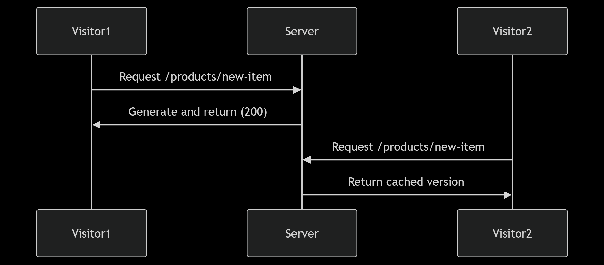

# RSC Lifecycle

## Key Players in RSC Rendering

Three core elements work in tandem:

1. **Browser (Client)**  
   - Displays the UI  
   - Handles user interactions  
   - Manages client-side state  

2. **Next.js Framework**  
   - Coordinates server-client communication  
   - Manages routing and data fetching  
   - Handles server-side rendering  

3. **React Library**  
   - Processes component rendering logic  
   - Manages the virtual DOM  
   - Handles hydration and updates  

---

## Initial Load Process


1. **Browser Initiation**  
   - Sends HTTP request to the server  
   - Requests the page and necessary data  

2. **Server Processing**  
   - Identifies and renders the correct Server Component (SC)  
   - Builds the complete component tree  
   - Prepares instructions for Client Components (CC)  
   - Generates two outputs:  
     - Immediate HTML for fast display  
     - RSC payload containing component metadata  

3. **Browser Rendering**  
   - Displays non-interactive UI from server HTML  
   - Gradually hydrates components  
   - Transitions to fully interactive UI  

---

## Update Process


1. **Change Detection**  
   - Browser detects need for update (route change, data refetch)  
   - Sends new request to server  

2. **Server Reconciliation**  
   - Identifies affected Server Components  
   - Renders updated component tree  
   - Prepares new Client Component instructions  
   - Generates optimized RSC payload  

3. **Client Update**  
   - Receives minimal update payload  
   - Performs efficient DOM patching  
   - Maintains existing UI state where possible  

---

## Key Characteristics

✔ **Server-Exclusive Rendering**  
   - SCs never bundle or execute in browser  
   - Zero client-side JavaScript footprint  

✔ **Progressive Enhancement**  
   - Immediate HTML → Hydrated UI  
   - Smooth transition to interactivity  

✔ **Optimized Updates**  
   - Only changed components re-render  
   - Minimal data transfer between server-client  

✔ **Separation of Concerns**  
   - SCs handle data and initial render  
   - CCs manage interactivity  

---

## Server Rendering Strategies

### Static Rendering

**Definition:**\
Static rendering generates HTML pages at build time, before any user requests occur. These pages are then served as-is to all users.

**How it Works:**

- Pages are pre-rendered during `next build`
- Generated HTML files are stored (can be cached by CDNs)
- Same content is served to all users initially
- Client-side hydration makes pages interactive

**Example Usage:**

```jsx
// app/blog/[slug]/page.js
async function BlogPost({ params }) {
  const post = await getBlogPost(params.slug);
  return <Article post={post} />;
}

export async function generateStaticParams() {
  const posts = await getAllBlogPosts();
  return posts.map((post) => ({ slug: post.slug }));
}
```

**Key Benefits:**

⚡ Blazing fast - Served directly from CDN

📈 Excellent SEO - Fully rendered HTML immediately available

💰 Cost effective - Reduced server load

🔒 Secure - No runtime server-side processing

**Best For:**

- Marketing pages
- Blog posts
- Documentation
- E-commerce product listings
- Any content that changes infrequently

---

### Dynamic Rendering

**Definition:**\
Dynamic rendering generates HTML at request time, enabling personalized content for each user. Next.js automatically applies this strategy when it detects dynamic functions or data requirements.

**How Next.js Handles It:**

- Automatically enabled when using:
  - `cookies()` / `headers()`
  - `searchParams` prop
  - `connection` info
  - `draftMode`
  - Dynamic data fetching (`no-store` cache)
- Can be forced with:
  ```js
  export const dynamic = 'force-dynamic'; // Page-level config
  ```
- Smart automatic selection between static/dynamic per route

**Example Usage:**

```jsx
// app/profile/page.js
import { cookies } from 'next/headers';

export const dynamic = 'force-dynamic'; // Explicit opt-in

async function ProfilePage() {
  const userToken = cookies().get('auth-token');
  const personalData = await fetchPersonalData(userToken);

  return (
    <div>
      <h1>Your Dashboard</h1>
      <RecentActivity feed={personalData.feed} />
    </div>
  );
}
```

**Key Benefits:**

🎭 Automatic personalization - Different content per request

🔄 Real-time data - Always current information

⚡ Smart defaults - Next.js chooses optimal strategy

🛠️ Flexible control - Force when needed

📱 Social media ready - Perfect for user-specific feeds

**When Next.js Automatically Uses It:**

- Page uses dynamic functions (cookies, headers)
- Component uses `searchParams` prop
- Data fetching specifies `no-store` cache
- Using Draft Mode (preview content)
- Accessing connection/client info

**Best For:**

- User profiles/dashboards
- Social media feeds
- Real-time analytics
- Authentication-gated content
- Personalized recommendations

---

### Streaming

**Definition:**\
Progressively streams rendered content to the client as it becomes ready.

**How it Works:**

- Server begins sending HTML immediately
- Content is sent in chunks as components finish rendering
- Placeholders show while waiting for slow components
- Final page assembles progressively in browser

**Example Usage:**

```jsx
// app/products/page.js
import { Suspense } from 'react';

async function ProductList() {
  const products = await getProducts(); // Slow data fetch
  return <ProductGrid products={products} />;
}

export default function Page() {
  return (
    <div>
      <HeroSection />
      <Suspense fallback={<ProductGridSkeleton />}>
        <ProductList />
      </Suspense>
    </div>
  );
}
```

**Key Benefits:**

⏱️ Faster perceived performance - User sees content sooner

🧩 Isolated slow components - Doesn't block entire page

📉 Better TTFB - Can start responding immediately

🔄 Smooth transitions - Between loading and loaded states

**Best For:**

- Pages with mixed fast/slow data requirements
- Dashboards with multiple data sources
- Large e-commerce category pages
- Content with user-specific personalization

---

### Development vs Production Behavior

| Aspect         | Development                     | Production                       |
| -------------- | ------------------------------- | -------------------------------- |
| Static Gen     | On-demand per request           | Once at build time               |
| Dynamic Gen    | Always fresh                    | Respects cache headers           |
| Streaming      | Simulated with artificial delay | Real performance characteristics |
| Error Handling | Detailed error overlays         | Custom error pages               |
| Caching        | Disabled                        | Optimized caching                |

**Key Differences:**

- Development server prioritizes DX with instant feedback
- Production server optimizes for performance and efficiency
- Static rendering behavior differs most significantly
- Always test production builds (`next start`) to verify real behavior

---

## Advanced Static Generation Controls

### generateStaticParams

**Purpose:**\
Pre-defines specific dynamic route combinations to be statically generated at build time.

**Key Features:**

- Works with dynamic route segments (`[param]`)
- Returns array of possible parameter combinations
- Enables static generation for dynamic routes
- Can be used with multiple dynamic segments

**Example Usage:**

```tsx
// app/products/[category]/[product]/page.tsx
export async function generateStaticParams() {
  return [
    { category: "electronics", product: "smartphone" },
    { category: "electronics", product: "laptop" },
    { category: "books", product: "science-fiction" },
    { category: "books", product: "biography" }
  ];
}

async function ProductPage({ params }) {
  const product = await getProduct(params.category, params.product);
  return <ProductDetail product={product} />;
}
```

**Behavior:**

Next.js will generate static pages for:

- `/products/electronics/smartphone`
- `/products/electronics/laptop`
- `/products/books/science-fiction`
- `/products/books/biography`

Other combinations will follow `dynamicParams` behavior.

**Best Use Cases:**

- Product catalogs with known items
- Content with finite, predictable variations
- Marketing campaigns with specific landing pages
- Any dynamic route with enumerable combinations

---

### dynamicParams

**Purpose:**\
Controls behavior when visiting dynamic routes not pre-defined in `generateStaticParams`.

**Configuration Options:**

```tsx
export const dynamicParams = true; // Default (on-demand static generation)
export const dynamicParams = false; // 404 for unknown params
```

**Example Usage:**

```tsx
// app/blog/[slug]/page.tsx
export const dynamicParams = false; // Only allow pre-defined slugs

export async function generateStaticParams() {
  return [{ slug: "welcome" }, { slug: "getting-started" }];
}

async function BlogPost({ params }) {
  // This will only be called for 'welcome' or 'getting-started' slugs
  const post = await getPost(params.slug);
  return <Article post={post} />;
}
```

**Behavior Modes:**

- **`dynamicParams = true` (Default):**
  - Unknown paths generate pages on-demand
  - First visitor triggers static generation
  - Subsequent visitors get cached version



- **`dynamicParams = false`:**
  - Unknown paths return 404
  - Only pre-defined paths work


**Best Use Cases:**

- **`true`:** Large catalogs where you want to gradually build cache
- **`false`:** Strictly controlled routes (e.g., limited-time offers)
- **`false`:** When all valid routes are known at build time

---

### Combining Both Features

**Optimal Pattern:**

```tsx
// app/products/[category]/[product]/page.tsx
export const dynamicParams = true; // Allow on-demand generation

export async function generateStaticParams() {
  // Pre-generate popular products
  return getTopSellingProducts().map(product => ({
    category: product.category,
    product: product.slug
  }));
}
```

**Benefits:**

- Critical paths are pre-rendered at build
- Less popular paths generate on first visit
- Maintains performance while covering all cases

---

## Server Only Code

### `server-only` Package

**Purpose:**  
Enforces that certain modules can only be used in Server Components, preventing accidental client-side usage.

**Installation:**
```bash
npm install server-only
```

**Usage Example:**

```tsx
// lib/server-utils.ts
import 'server-only';

export async function getSensitiveData() {
  const res = await fetch('https://api.example.com', {
    headers: {
      Authorization: `Bearer ${process.env.SECRET_KEY}`
    }
  });
  return res.json();
}

// app/page.tsx
import { getSensitiveData } from '../lib/server-utils'; // ✅ Works

// app/client-component.tsx
'use client';
import { getSensitiveData } from '../lib/server-utils'; // ❌ Build error
```

**Key Benefits:**

🔒 Prevents sensitive server code from leaking to client

🚨 Throws clear build-time errors

🏷️ Self-documenting code boundaries

---

## Third Party Packages

### Handling Server-Side Dependencies

**Example (Database Client):**

```tsx
// lib/db.ts
import { Pool } from 'pg';

const pool = new Pool({
  connectionString: process.env.DATABASE_URL
});

export async function getProducts() {
  return pool.query('SELECT * FROM products');
}

// app/products/page.tsx
import { getProducts } from '../lib/db';

export default async function ProductsPage() {
  const products = await getProducts();
  return <ProductList products={products.rows} />;
}
```

**Best Practices:**

- Wrap server-only packages in dedicated modules
- Add `server-only` import where appropriate
- Never import server-only packages in Client Components

---

## Context Providers

### Server-Side Context Pattern

**Example:**

```tsx
// app/providers.tsx
'use client';
import { createContext } from 'react';

export const UserContext = createContext(null);

// app/layout.tsx
import { UserContext } from './providers';
import { getUser } from './server-auth';

export default async function RootLayout({ children }) {
  const user = await getUser();
  
  return (
    <html>
      <body>
        <UserContext.Provider value={user}>
          {children}
        </UserContext.Provider>
      </body>
    </html>
  );
}
```

---

## Client-only Code

### Client Component Placement

**Best Practices:**

- Place client components in `app/components/` directory
- Use the `'use client'` directive at the top
- Keep them as leaf nodes when possible

**Example Structure:**

```
app/
  components/
    Counter.tsx    # Client component
    Carousel.tsx   # Client component
  page.tsx         # Server component
```

**Usage Example:**

```tsx
// app/components/Counter.tsx
'use client';
import { useState } from 'react';

export function Counter() {
  const [count, setCount] = useState(0);
  return (
    <button onClick={() => setCount(c => c + 1)}>
      Count: {count}
    </button>
  );
}

// app/page.tsx
import { Counter } from './components/Counter';

export default function Home() {
  return (
    <div>
      <h1>Home Page</h1>
      <Counter />
    </div>
  );
}
```

---

## Interleaving Server and Client Components

### Composition Patterns

**1. Children Prop Pattern:**

```tsx
// app/components/ClientWrapper.tsx
'use client';
export function ClientWrapper({ children }) {
  const [active, setActive] = useState(false);
  return (
    <div onClick={() => setActive(!active)}>
      {children}
    </div>
  );
}

// app/page.tsx
import { ClientWrapper } from './components/ClientWrapper';

export default function Page() {
  return (
    <ClientWrapper>
      <ServerContent />
    </ClientWrapper>
  );
}
```

**2. Props Passing Pattern:**

```tsx
// app/components/ProductView.tsx
'use client';
export function ProductView({ productData }) {
  const [quantity, setQuantity] = useState(1);
  return (
    <div>
      <h2>{productData.name}</h2>
      <p>{productData.description}</p>
      <input
        type="number"
        value={quantity}
        onChange={(e) => setQuantity(Number(e.target.value))}
      />
    </div>
  );
}

// app/product/[id]/page.tsx
import { ProductView } from '../../components/ProductView';

export default async function ProductPage({ params }) {
  const product = await getProduct(params.id);
  return <ProductView productData={product} />;
}
```

**3. Slot Pattern:**

```tsx
// app/components/InteractiveCard.tsx
'use client';
export function InteractiveCard({ header, body }) {
  const [expanded, setExpanded] = useState(false);
  return (
    <div className={`card ${expanded ? 'expanded' : ''}`}>
      <div onClick={() => setExpanded(!expanded)}>
        {header}
      </div>
      {expanded && body}
    </div>
  );
}

// app/page.tsx
import { InteractiveCard } from './components/InteractiveCard';

export default function Page() {
  return (
    <InteractiveCard
      header={<h2>Server-rendered header</h2>}
      body={<p>Server-rendered body content</p>}
    />
  );
}
```

---

## Key Rules

- Server Components **can** import and render Client Components
- Client Components **cannot** import Server Components
- Props passed between boundaries **must be serializable**
- `className` and `style` props are preserved across boundaries

---