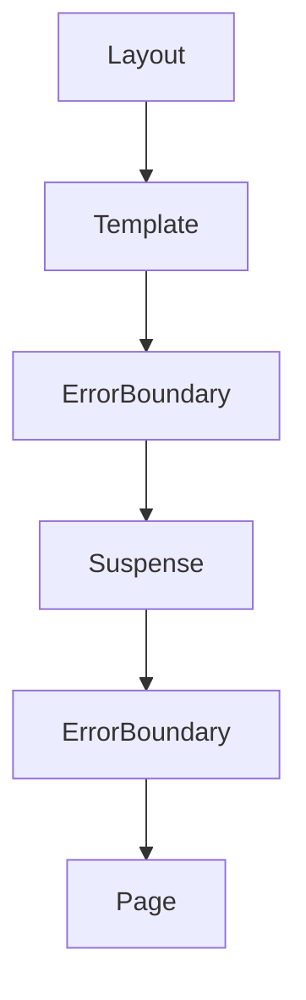

# Error Handling in Next.js

Next.js provides a powerful file-system based error handling system through the `error.tsx` convention. This builds on React Error Boundaries to give you granular control over error recovery.

## 🗂️ Component Hierarchy



As shown in the hierarchy:

```tsx
<Layout>
  <Template>
    <ErrorBoundary fallback={<Error />}>
      <Suspense fallback={<Loading />}>
        <ErrorBoundary fallback={<NotFound />}>
          <Page />
        </ErrorBoundary>
      </Suspense>
    </ErrorBoundary>
  </Template>
</Layout>
```

## ✨ Key Features
- **Automatic Error Boundaries**: Wraps route segments and their children
- **Granular Control**: Custom errors for specific route segments
- **Isolated Errors**: Only affected segments show errors
- **Recovery Options**: Attempt recovery without full page reload

## 🛠️ Basic Implementation

Create an `error.tsx` file in any route segment:

```tsx
// app/dashboard/error.tsx
'use client';

export default function DashboardError({
  error,
  reset,
}: {
  error: Error & { digest?: string }
  reset: () => void
}) {
  return (
    <div className="flex flex-col items-center justify-center min-h-screen p-4">
      <h2 className="text-2xl font-bold text-red-600 mb-4">Something went wrong!</h2>
      <p className="text-gray-700 mb-6">{error.message}</p>
      <button
        onClick={reset}
        className="px-4 py-2 bg-blue-600 text-white rounded hover:bg-blue-700 transition"
      >
        Try Again
      </button>
    </div>
  );
}
```

---

## 🧩 Advanced Patterns

### 1. Route-Specific Errors

```
app
 ├── (marketing)
 │   └── error.tsx  # Marketing-specific errors
 └── (app)
     └── error.tsx  # App-specific errors
```

### 2. Type-Safe Error Handling

```tsx
interface CustomError extends Error {
  type?: 'auth' | 'validation' | 'server'
  statusCode?: number
}

export default function ErrorComponent({ error, reset }: { error: CustomError, reset: () => void }) {
  if (error.type === 'auth') {
    return <AuthError error={error} reset={reset} />
  }
  // ... other error types
}
```

### 3. Error Logging

```tsx
useEffect(() => {
  console.error('Route error:', error)
  logErrorToService(error)
}, [error])
```

---

## 🧩 Practical Example

```tsx
// app/products/[id]/error.tsx
'use client';

export default function ProductError({ error, reset }: { error: Error, reset: () => void }) {
  return (
    <div className="max-w-2xl mx-auto p-6">
      <div className="bg-red-50 border-l-4 border-red-500 p-4">
        <div className="flex">
          <div className="flex-shrink-0">
            <XCircleIcon className="h-5 w-5 text-red-500" />
          </div>
          <div className="ml-3">
            <h3 className="text-sm font-medium text-red-800">
              Failed to load product
            </h3>
            <div className="mt-2 text-sm text-red-700">
              <p>{error.message}</p>
            </div>
            <div className="mt-4">
              <button
                type="button"
                onClick={reset}
                className="inline-flex items-center px-3 py-2 border border-transparent text-sm leading-4 font-medium rounded-md text-red-700 bg-red-100 hover:bg-red-200"
              >
                Retry
              </button>
            </div>
          </div>
        </div>
      </div>
    </div>
  );
}
```

---

## 🧱 Handling Errors in Layouts

Layouts can also have their own `error.tsx` to catch errors from any children route segments.

### 🧪 Example: Layout Error

**File Structure:**
```
app
├── dashboard
│   ├── layout.tsx
│   └── error.tsx   ← Handles layout-level errors
└── page.tsx
```

**dashboard/layout.tsx**
```tsx
export default function DashboardLayout({ children }: { children: React.ReactNode }) {
  return (
    <div>
      <nav>/* Sidebar */</nav>
      <main>{children}</main>
    </div>
  );
}
```

**dashboard/error.tsx**
```tsx
'use client';

export default function DashboardLayoutError({ error, reset }: { error: Error, reset: () => void }) {
  return (
    <div className="text-center py-20">
      <h2 className="text-2xl font-semibold text-red-600">Dashboard layout failed</h2>
      <p className="mt-4 text-gray-600">{error.message}</p>
      <button onClick={reset} className="mt-6 px-4 py-2 bg-blue-500 text-white rounded">Reload layout</button>
    </div>
  );
}
```

---

## 🌐 Global Error Handling in Next.js

Next.js provides a robust error handling system through error boundaries, but some errors occur at the root level where regular error boundaries can't catch them. This is where `global-error.tsx` comes into play.

### Understanding Global Error Boundaries

- Root layout errors can't be caught by regular error boundaries
- `global-error.tsx` serves as the final safety net
- It only works in **production mode**
- Requires explicit `<html>` and `<body>` tags

### Key Differences

| Feature                 | error.tsx          | global-error.tsx     |
|------------------------|--------------------|-----------------------|
| Scope                  | Route segment      | Entire application    |
| Catches layout errors  | No                 | Yes                   |
| Production only        | No                 | Yes                   |
| HTML/Body required     | No                 | Yes                   |
| Development mode       | Shows errors       | Doesn't catch errors  |

### Implementation Example

```tsx
// app/global-error.tsx
'use client';

export default function GlobalError({
  error,
  reset,
}: {
  error: Error & { digest?: string }
  reset: () => void
}) {
  return (
    <html>
      <body>
        <div className="min-h-screen flex flex-col items-center justify-center bg-gray-50 p-4">
          <div className="max-w-md w-full bg-white p-8 rounded-lg shadow-md text-center">
            <h2 className="text-2xl font-bold text-red-600 mb-4">
              Application Error
            </h2>
            <p className="text-gray-700 mb-6">
              A critical error occurred in our application. We apologize for the inconvenience.
            </p>
            <div className="space-y-3">
              <button
                onClick={reset}
                className="w-full px-4 py-2 bg-blue-600 text-white rounded hover:bg-blue-700 transition"
              >
                Try Again
              </button>
              <a
                href="/"
                className="inline-block w-full px-4 py-2 border border-gray-300 rounded hover:bg-gray-100 transition"
              >
                Return Home
              </a>
            </div>
            {process.env.NODE_ENV === 'development' && (
              <details className="mt-6 text-left">
                <summary className="text-sm text-gray-500 cursor-pointer">
                  Error Details
                </summary>
                <pre className="mt-2 p-2 bg-gray-100 rounded text-xs overflow-x-auto">
                  {error.stack}
                </pre>
                <p className="mt-2 text-xs text-gray-500">
                  Digest: {error.digest}
                </p>
              </details>
            )}
          </div>
        </div>
      </body>
    </html>
  );
}
```

### Best Practices
- **User-Friendly Design**: Keep the UI clean and reassuring
- **Multiple Recovery Options**: Provide both retry and home options
- **Dev vs Prod**: Show full stack trace in dev, log silently in prod

```tsx
useEffect(() => {
  console.error('Global error:', error);
  logErrorToService(error);
}, [error]);
```

### When to Use Global Error Boundary
- Root layout errors
- Critical CSS/font loading failures
- Auth provider failures
- Global state management crashes
- Catastrophic app-wide issues

### Testing Global Errors

```tsx
// app/test/error/page.tsx
export default function ErrorTestPage() {
  throw new Error('This is a test error');
  return <div>This won't render</div>;
}
```

Run your app in production mode:

```bash
npm run build
npm run start
```

---

## 🔄 Recovery Strategies

### Simple Retry:
```tsx
<button onClick={reset}>Try Again</button>
```

### Alternative Content:
```tsx
return (
  <div>
    <p>Couldn't load premium content</p>
    <FreeContentFallback />
  </div>
)
```

### Redirect:
```tsx
useEffect(() => {
  if (error.type === 'auth') {
    router.push('/login')
  }
}, [error])
```

---

## 📌 Best Practices
- **User-Friendly Messages**: Avoid technical jargon
- **Helpful Actions**: Provide clear next steps
- **Design Consistency**: Match your app's style
- **Error Logging**: Always track errors

### Production Checks:
```tsx
export default function ErrorBoundary() {
  if (process.env.NODE_ENV === 'development') {
    return <DevErrorView />
  }
  return <ProdErrorView />
}
```

---

## 🚀 Complete Error Handling System

Combine with other special files:
```
app
 ├── layout.tsx
 ├── template.tsx
 ├── error.tsx         # General errors
 ├── not-found.tsx     # 404 errors
 ├── loading.tsx       # Loading states
 ├── global-error.tsx  # Catch-all root errors
 └── page.tsx
```

This system gives you complete control over the error handling experience in your Next.js application.

